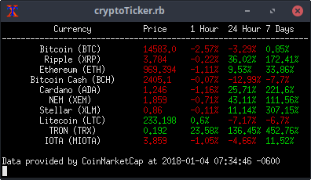

# cryptoTicker
cryptoTicker is a Ruby CLI script that retrieves data from CoinMarketCap and displays them.

### Display Limits
The default display limit is the Top 10 Crypto Currencies from CoinMarketCap.  To change this, edit the ``cryptoTicker.rb`` file and change ``display(10)`` on Line #71 with how many currencies you want to display.

### Refresh Rate
This ticker runs in a loop and is updated every 60 seconds.  If you want to change the refresh timer, edit ``cryptoTicker.rb`` and change ``sleep 300`` pn Line #72 to whatever value you want, in seconds.
